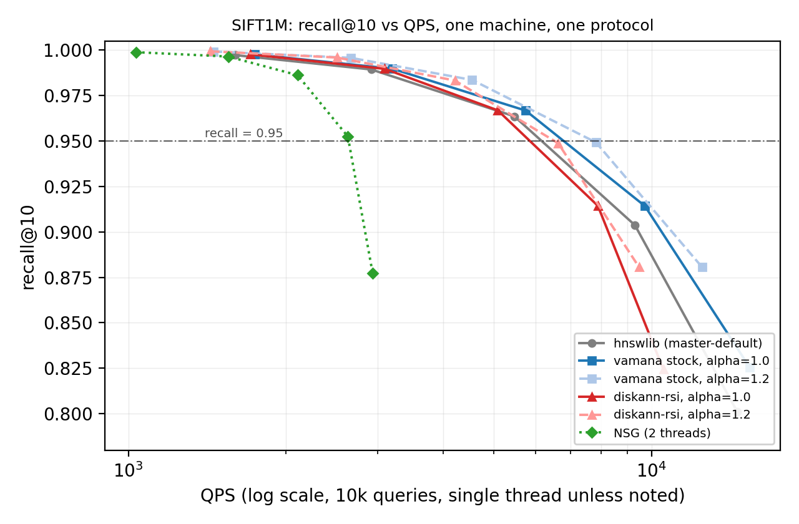

# DiskANN-RSI

A Rust-native Vamana/DiskANN vector index whose **query path was iteratively optimized by an automated research loop (RSI)**, plus a same-machine, single-protocol reproducibility study against stock Vamana, hnswlib, and NSG.

This repository accompanies the paper draft in [`paper/main.tex`](paper/main.tex) and contains everything needed to reproduce the measurements: code, benchmark harness, raw data, and runbook.

> **Upstream.** This project is a fork of the Rust rewrite of [microsoft/DiskANN](https://github.com/microsoft/DiskANN) (MIT). NSG-related code is attributed in [NOTICE.txt](NOTICE.txt). The RSI query-path changes relative to upstream are in [`docs/final_patch.diff`](docs/final_patch.diff).

## Headline results (SIFT1M, recall@10, single thread)

Measured on one cloud VM (2 vCPU / 3.6 GB RAM + 8 GB swap, OpenCloudOS 9.4), 2026-09-16, 10k queries × 3 reps:

| System | QPS @ recall≥0.95 | recall@10 | Build time | Peak mem |
|---|---|---|---|---|
| hnswlib (master-default) | **6077** | 0.9637 | 238.6s | 1.31 GB |
| vamana (stock, α=1.0) | 5708 | 0.9667 | 255.0s | 1.27 GB |
| **diskann-rsi (α=1.0)** | 5078 | 0.9669 | **131.9s** | 1.28 GB |
| nsg (2-thread) | 2643 | 0.9525 | 451s (+kNN graph, hours) | 1.40 GB |

- Regime-independent wins of the RSI changes: **1.9× faster index build** than stock Vamana at equal graph quality, **1.87× two-thread scaling** (vs 1.75×).
- Inside the optimizer's own harness the same changes showed **+55% QPS@recall≥0.95** (2994.6 → 4641.1); under the unified protocol they do not transfer uniformly (see paper §5.4 for why).
- Full recall–QPS ladders, per-optimization measurements, and negative results: [`docs/BENCHMARKS.md`](docs/BENCHMARKS.md).



*Recall@10 vs QPS, reconstructed from the frozen raw rows in [`bench/results/`](bench/results/) by [`bench/plots/recall_qps.py`](bench/plots/recall_qps.py); each marker is the median over repeats. NSG is measured at two threads, all other systems at one.*

## What the RSI loop changed

1. **Epoch-stamped visited set with 16-bit stamps** — dense per-query stamps, O(1) clear; 4 MB → 2 MB footprint at 1M points; visited-set time −45%, beam-expansion −19% (instrumented).
2. **Adaptive early termination** — frontier-vs-kth-distance ratio stop rule (default ratio 1.2, min_hops 8); −10% distance computations at L=60, −50% at L=200, recall unchanged.
3. **Tuning levers in `job.json`** — `prefetch_lookahead`, `beam_width`, `early_stop_ratio`, `early_stop_min_hops` (measured sweeps documented in the paper).
4. **Fat LTO release builds** — cross-crate inlining on the provider→distance-kernel path; +10–12% search QPS.
5. **Recall-stacking build configurations** (10K study) — denser graphs via `l_build`/`max_degree`/insert-retry; recall@10 0.909 → 1.000 trade-off curves.

Measured **negative results** (kept out of the build): SQ8+rerank (no gain when the working set is cache-resident), candidate-queue merge insertion, random-projection reordering, partial-distance early exit at 128-dim, beam width > 1 at 1T.

## Quickstart

```bash
# Rust toolchain per rust-toolchain.toml
cargo build --release          # fat LTO enabled; ~6 min

# Prepare SIFT1M (fbin + ground truth)
python3 tools/prepare_sift1m.py /path/to/sift

# Configure and run the benchmark (build + search + recall/QPS sweep)
$EDITOR job.json               # data paths, R/l_build/alpha, search_l ladder, recall_target
cargo run --release -p diskann-benchmark-runner
```

Raw measurements from the paper are in [`bench/results/`](bench/results/) (`vamana.jsonl`, `diskann_opt.jsonl`, `hnswlib.jsonl`, `nsg.jsonl`).

## Repository layout

- `diskann*/` — workspace crates (algorithm, providers, disk, quantization, benchmark, tools); see [`agents.md`](agents.md) for the full map
- `paper/` — arXiv-ready LaTeX draft of the study
- `docs/` — `BENCHMARKS.md` (full tables), `final_patch.diff` (RSI diff vs upstream)
- `bench/results/` — raw measurement records (JSONL)
- `tools/`, `diskann-tools/` — SIFT1M preparation and conversion utilities
- `generated_data/` — tiny 10K smoke-test dataset used by the harness

## Citation

```bibtex
@misc{diskann-rsi-2026,
  title  = {DiskANN-RSI: Query-Path Optimizations for a Rust-Native Vamana Index,
            and a Same-Machine Reproducibility Study},
  author = {Kang, Zhanhui},
  year   = {2026},
  howpublished = {\url{https://github.com/tersemind/diskann-rsi}}
}
```

## License

MIT — see [LICENSE.txt](LICENSE.txt) and [NOTICE.txt](NOTICE.txt). Includes attribution to microsoft/DiskANN and ZJULearning/nsg.
